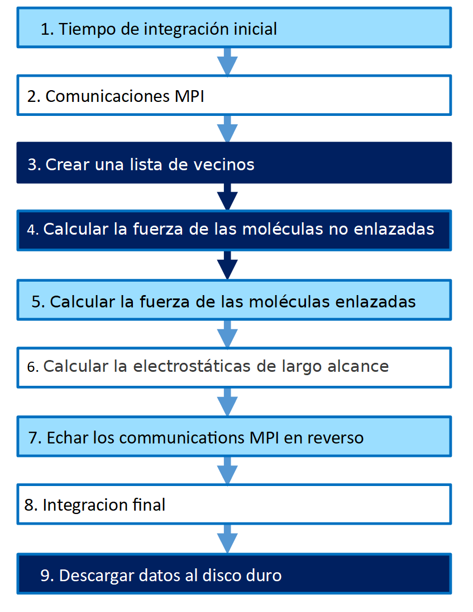

# La Guía para optimizar el LAMMPS en la Plataforma de Procesadores Escalables Intel®️ Xeon®️ de 3a Generación

## 1. Introducción 

Esta guía es para usuarios del LAMMPS.  Incluye las recomendaciones para configurar el BIOS, el sistema operativo (OS) y el software LAMMPS con los ajustes que pueden acelerar las simulaciones LAMMPS en muchas situaciones.  Les recomendamos que aumenten el rendimiento usando estas configuraciones del hardware y software.  Tengan en cuenta que confiamos en que los usuarios consideren cuidadosamente todas las configuraciones porque los escenarios específicos del LAMMPS se pueden implementar de varias maneras.

En el inglés, el acrónimo LAMMPS significa:  Large-scale Atomic/Molecular Massively Parallel Simulator.  Según el departamento de Informática Aplicada a la Investigación de la Universidad del País Vasco, “el LAMMPS es un código de dinámica molecular clásica que modela conjuntos de partículas en estado líquido, sólido o gaseoso”. [1]    El LAMMPS se puede usar para simular los movimientos físicos de átomos y de moléculas.   Se requieren muchos calculos para crear estas simulaciones por lo que el LAMMPS fue diseñado para ejecutar de manera eficiente en computadoras paralelas para acelerar los cálculos y mantener resultados precisos.  Puede obtener más información:  https://lammps.sandia.gov/doc/Packages_details.html.  En el paquete llamado INTEL® para el LAMMPS hay métodos para acelerar las simulaciones usando los procesadores de Intel®.  Este artículo le recomienda cómo optimizar la plataforma de los procesadores escalables Intel® Xeon® de 3a Generación.  

Los procesadores escalables Intel® Xeon® de 3a Generación contienen plataformas optimizadas para cargas de trabajo líderes en la industria con aceleración de IA (Inteligencia Artificial) integrada.  Estos procesadores tienen el rendimiento que ayudan a acelerar el impacto transformador de los datos desde el perímetro (Edge) a la nube (Cloud) y viceversa.  Las mejoras específicas del LAMMPS incluyen:   

- Rendimiento mejorado
- Más Intel® Ultra Path Interconnect
- Intel® Advanced Vector Extensions

El hardware y el software que fueron probadas:

#### Configuración del Servidor

Hardware

| Plataforma del Servidor | Intel® Coyote Pass Server Platform |
|----------------------|------------------------------------------|
| CPU | Intel® Xeon® PLATINUM 8360Y CPU @ 2.20GHz |
| BIOS | SE5C6200.86B.0021.D40.2101090208 |
| Memoria RAM |	256GB 16*16GB 3200MT/s DDR4, Hynix HMA82GR7CJR8N-XN |
| Almacenamiento/Disco Duro | 	SSDSC2KG96 960GB |

Software

|Sistema Operativo | CentOS Linux release 8.3.2011 |
|------------------|------------------------------|
| Kernel |	4.18.0-240.22.1.el8_3.crt1.x86_64 |


Nota:  La configuración que describe este artículo es de la tercera generación de los procesadores del hardware de Intel® Xeon®.  Las plataformas del servidor, memoria, las discos duros y tarjetas de interfaz de red pueden ser determinados de acuerdo con los requisitos de usos específicos de los clientes.
    
## 2. Optimización del Hardware

### 2.1. Configurar el BIOS

Regrese a la configuración de base del BIOS.  Siga estas sugerencias:

|Ajuste | Recomendación |
|-------|---------------|
| Advanced/Power & Performance/CPU P State Control/CPU P State Control/Intel® Turbo Boost Technology | Activar |
| Advanced/Processor Configuration/Intel® Hyper-Threading Tech | Activar |
| SNC (Sub-Numa Cluster) | Activar |

#### 2.1.1. Descripción del ajustes BIOS

Active estos ajustes para optimizar el rendimiento del LAMMPS:  
- lntel® Turbo Boost Technology da al procesador la habilidad de aumentar la frecuencia automáticamente si se está ejecutando debajo de la especificación de la actual energía o de la temperatura.  
- lntel® Hyper—Threading Technology da a las aplicaciones de software de multiproceso la habilidad de ejecutar dos procesos en paralelo dentro de cada núcleo del procesador.  Esto resulta en la habilidad de ejecutar dos procesos de núcleo lógico más que el proceso de núcleo físico.
- SNC (Sub-Numa Cluster) diseñada para mejorar la opción Cluster-on-Die (COD) que estuvo disponible en los procesadores Intel® Xeon® E5-2600 v3 y v4.  Mejora el acceso a un puerto remoto cuando se está usando los procesadores escalables Intel® Xeon® de 3a Generación.  En el sistema operativo, cuatro dominios NUMA se mostrará en un servidor dual socket con la activación de SNA.  Dos dominios estarán en el mismo socket y los dos otros estarán atravezando el UPI a un puerto remoto.  Active el SNC para mejorar el rendimiento.    

### 2.2. Configurar la memoria RAM 

Generalmente los usuarios usan varios nodos para que la memoria RAM pueda ser más pequeña en cada nodo. 

#### Configuración del Almacenamiento/Disco Duro 

Para mejorar la velocidad de inicio y la velocidad de cargas de trabajo, instala el sistema operativo y el LAMMPS en un SSD.  Usa otro SSD más grande para guardar proyectos pasados o cuando se usa Visual Molecular Dynamics (VMS) para crear videos animaciones o películas de sus simulaciones.

### 2.3. Configurar la Red 

El mejor rendimiento del LAMMPS se ha visto cuando se usa Intel® MPI para procesar los conjuntos de datos en varios nodos.  Intel® MPI es una biblioteca se que usa para que el HPC puede procesar en paralelo.

## 3. Optimización del Software LAMMPS

La optimización de la configuración del software es necesario.  La configuración base del sistema operativo y la configuración base del software del LAMMPS fueron diseñados para aplicaciones generales.  Tiene que optimizar su software para lograr un mejor rendimiento del sistema..

### 3.1. Configurar el Linux Kernel CentOS 8.*

< No hay ninguna configuración de carga de trabajo específico para este tema. >   

### 3.2. La arquitectura del LAMMPS 

EL LAMMPS apoyo varias modelos simulaciones diferentes.  



El diagrama de abajo muestra un ejemplo de un paso de tiempo para sistemas moleculares con electrostática de largo alcance. 

Figure 1:  Ejemplo de un paso temporal para sistemas moleculares con electrostática de largo alcance

Generalmente, paso 3, paso 9 y, opcionalmente, paso 6 no ocurren en todos los pasos a seguir. 

Para mejorar el rendimiento del cálculos, use el ajuste, “newton off” (Sección 3.5) para que el paso 7 no se ejecute.  También, use el ajuste LRT (Sección 3.5) para ejecutar el paso 6 en paralelo con pasos 4 y 5.  El paso 6 se ejecutará en un proceso hyperthread que es separado de los otros.

## 3.3. Compilar el LAMMPS con las optimizaciones de procesadores de Intel® 

Hay muchos cálculos en las simulaciones de LAMMPS.  Para acelerar estos cálculos se usa el paquete INTEL para el LAMMPS.  Lo incluye cuando compile el software LAMMPS.

Descargue el repositorio git LAMMPS.  Hay más instrucciones en el archivo léeme (en el inglés:  README file) en el repositorio LAMMPS github.

```
git clone -b stable https://github.com/lammps/lammps.git lammps
```

Instale el paquete, INTEL para el LAMMPS:

```
cd lammps/src
make yes-intel
```

Compile con Intel® oneAPI. 

Los ajustes para compilar están en este archivo:  src/MAKE/OPTIONS/Makefile.intel_cpu_intelmpi file

```
source /opt/intel/oneapi/setvars.sh
make intel_cpu_intelmpi -j
```

El proceso de compilación creará este nuevo archivo binario:  lmp_intel_cpu_intelmpi.


## 3.4. Ejecutar el LAMMPS

La manera más fácil para usar el paquete INTEL para el LAMMPS, es agregar este parámetro de línea de comandos:  “-sf intel”.  Entonces, las optimizaciones estarán disponible para la simulación.  El número de procesos OpenMP que estará usando puede estar controlado con el variable entorno, OMP_NUM_THREADS o puede agregar este parámetro de línea de comandos para controlarlos:

```
-pk intel 0 omp $N” for N OpenMP threads.
```

```
mpirun -np 72 -ppn 36 lmp_intel_cpu_intelmpi -sf intel -in in.script                                 
# 2 nodes, 36 MPI tasks/node, $OMP_NUM_THREADS OpenMP Threads

mpirun -np 72 -ppn 36 lmp_intel_cpu_intelmpi -sf intel -in in.script -pk intel 0 omp 2 mode double  
# Use 2 OpenMP threads for each MPI task, use double precision
```

## 3.5. Optimizar el rendimiento

Generalmente, el mejor rendimiento pueda lograr se cuando se ejecuta 1 tarea MPI por núcleo físico.  Muchas veces el rendimiento puede ser mucho mejor con 2 procesos OpenMP para aprovechare hyperthreading en el núcleo. 

#### Newton

Para algunos potenciales simples de 2-cuerpos tal como lj/cut, el rendimiento y adaptabilidad puede mejorar si apaga el ajuste “newton”.  También, se puede mejorar el rendimiento cuando se usa el modo LRT en procesadores que soporte AVX-512.  

#### LRT

El modo de “Long-Range Thread (LRT)” es una opción en el paquete INTEL para el LAMMPS que puede mejorar el rendimiento cuando se usa PPPM para electrostática de larga distancia en procesadoras con hyperthreading.  Se crea un pthread más para cada tarea de MPI.  Este subproceso se dedica a realizar alguna de los cálculos de PPPM y las comunicaciones de MPI.  Para usar esta característica, encender esta indicador en el makefile antes de compilar:   a -DLMP_INTEL_USELRT.  
Cuando se usa LRT, enciende la variable “KMP AFFINITY=none”.  

Para activar el modo de LRT, especifique que el número de subprocesos OpenMP sea uno menos de lo que normalmente se usa.  Luego, agregue la opción de “lrt yes”.   
```
Ejecutar sin el modo de LRT:	-pk intel 0 omp 4
Ejecutar con el modod de LRT:	-pk intel 0 omp 3 lrt yes
```

## 3.6. Hacer una evaluación comparativa LAMMPS estándar

Las puntos de referencia disponibles para probar varios modelos de simulaciones diferentes.  Los siguientes pasos son instrucciones para ejecutar estan evaluaciones comparativas:  1) un fluido atómico, 2) una proteína, 3) el método del átomo cobre con el atómo incrustado, 4) dinámica de partículas disipativas, 5) polietileno con el campo de fuerza AIREBO, 6) silicio con modelo Tersoff de 3 cuerpos, 7) silicio con potencial Stillinger-Weber de 3 cuerpos, 8) agua de grano grueso utilizando un potencial de 3 cuerpos, y 9) una simulación de cristal líquido.  

Para ejecutar estas evaluaciones comparativas, instale los siguientes paquetes antes de compilar el LAMMPS:

```
make yes-asphere yes-class2 yes-dpd-basic yes-kspace yes-manybody yes-misc yes-molecule yes-mpiio yes-opt yes-replica yes-rigid yes-intel
```

Cambie al carpeta: 

```
cd lammps/src/INTEL/TEST
```

Establesca la cantidad de PCORES para que sea el número de núcleos físicos en el sistema y ejecute las evaluaciones comparativas.  El resumen del rendimiento de los números - mayor o más es mejor - de los archivos de registro que informar los pasos a seguir por segundo.  Estos resultados estarán guardados en el archivo log.

```
PCORES=`lscpu | awk '$1=="Core(s)"{t=NF; cores=$t}$1=="Socket(s):"{t=NF; sockets=$t}END{print cores*sockets}'`;
sed -i "s/36/$PCORES/g" run_benchmarks.sh; sed -i 's/"2"/"1 2"/g' run_benchmarks.sh
./run_benchmarks.sh
```

## 3.7. Descargar, compilar y hacer una evaluación comparativo con un comando

En algunos sistemas con instalaciones estándar de oneAPI, el siguiente comando se puede usar para descargar, compilar y hacer una evaluación comparativa.  Algunas configuraciones podría necesitar modificaciones. 

```
source /opt/intel/oneapi/setvars.sh; git clone -b stable https://github.com/lammps/lammps.git lammps; cd lammps/src; make yes-asphere yes-class2 yes-dpd-basic yes-kspace yes-manybody yes-misc yes-molecule yes-mpiio yes-opt yes-replica yes-rigid yes-openmp yes-intel; make intel_cpu_intelmpi -j; cd INTEL/TEST; PCORES=`lscpu | awk '$1=="Core(s)"{t=NF; cores=$t}$1=="Socket(s):"{t=NF;
sockets=$t}END{print cores*sockets}'`; sed -i "s/36/$PCORES/g" run_benchmarks.sh; sed -i
's/"2"/"1 2"/g' run_benchmarks.sh; ./run_benchmarks.sh
```

## 4. Conclusión

LAMMPS incluye optimizaciones que pueden acelerara las simulaciones.   Estas optimizaciones se deben habilitar con las opciones de compilación y ejecución adecuadas, tal como se describen en este documento.

## 5. Fuentes

[1] Molecular Dynamics at https://en.wikipedia.org/wiki/Molecular_dynamics as of August 23, 2021 

[2] LAMMPS documentation at https://docs.lammps.org/Speed_intel.html#tuning-for-performance as of August 23, 2021


