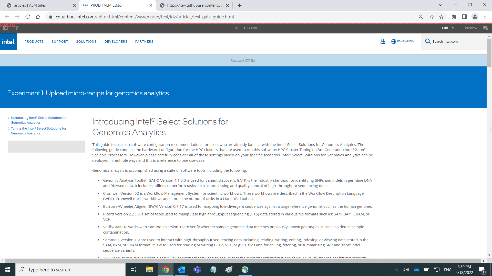
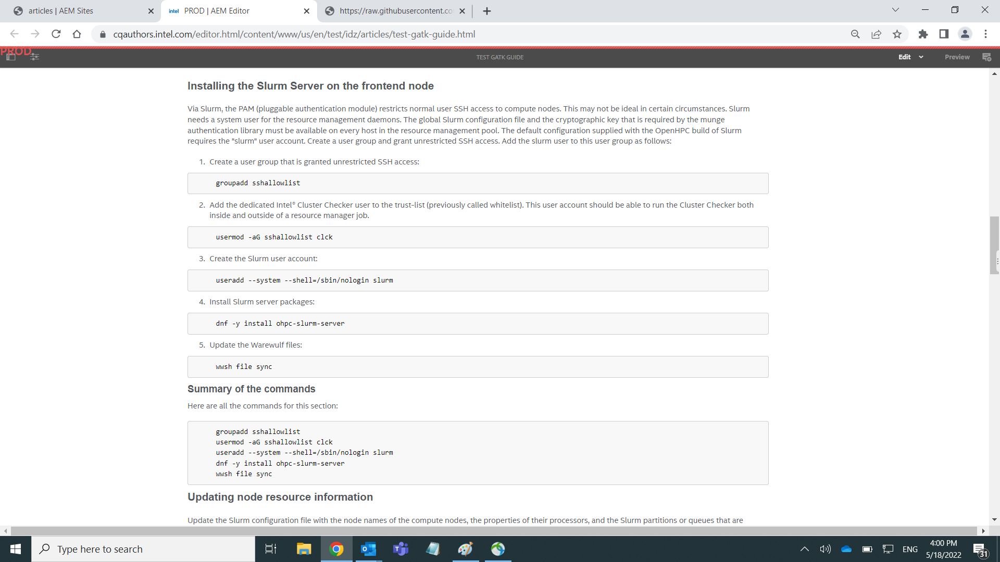
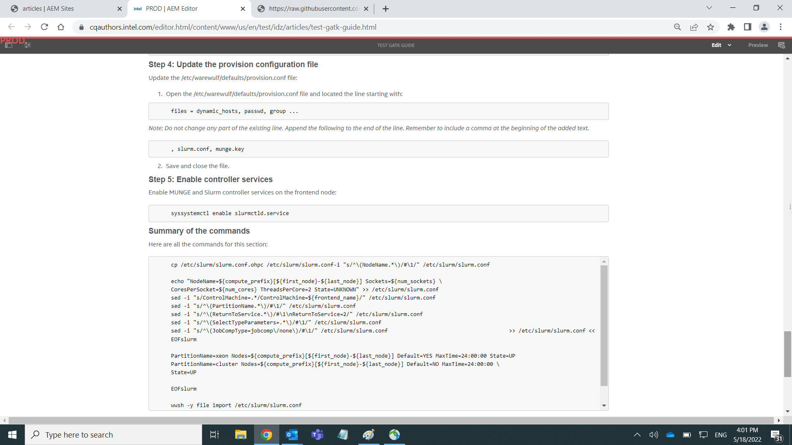

# Experiments:  Automate Publishing Code Snippets

## 1. Experiment 1

Using content and code snippets from the <i>Tuning Guide for Intel® Select Solutions for Genomics Analytics on 3rd Generation Intel® Xeon® Scalable Processors Based Platform</i>, create a template to structure content so that each group of code snippets and their corresponding instructions can be maintained separately by an Intel developer.  Write a Python script to assemble these markdown files into one markdown file for the entire tuning guide that can be loaded into DevZone.  For purposes of these experiments, this file is called the "DevZone markdown" file.  Future experiments will consider more automation.

### File contents:

content_order - contains the order in which the code and text snippets should be arranged, for example:

```
https://raw.githubusercontent.com/NelsonPython/tuningGuides/main/experiment/002_intro.md
https://raw.githubusercontent.com/NelsonPython/tuningGuides/main/experiment/003_Configuring_the_Slurm_Workload_Manager.md
https://raw.githubusercontent.com/NelsonPython/tuningGuides/main/experiment/004_summary.md
https://raw.githubusercontent.com/NelsonPython/tuningGuides/main/experiment/005_Updating_node_resource_information.md
https://raw.githubusercontent.com/NelsonPython/tuningGuides/main/experiment/006_summary.md
```

001_title.md - the title may not be included in the DevZone markdown file

002_intro.md - contains all content prior to the first code snippet

#### Instructions and code snippet files:
There are multiple blocks of code and two files for each block:  
- step-by-step instructions along with code
- block of code that a developer can cut-and-paste directly into the command line

Test data for this experiment is two actual code blocks from our most complex tuning guide:
```
003_Configuring_the_Slurm_Workload_Manager.md
004_summary.md

005_Updating_node_resource_information.md
006_summary.md
```

## Python script

```
import requests

url = "https://raw.githubusercontent.com/NelsonPython/tuningGuides/main/experiment/content_order.md"

payload={}
headers = {}
md = ''

response = requests.request("GET", url, headers=headers, data=payload)
print(response.text)

contents = response.text.split("\n")

for content in contents:
    if len(content) > 0:
        res2 = requests.request("GET",content, headers=headers, data=payload)
        md += (res2.text)

print(md)
```

## Results - Experiment 1

[See DevZone_Markdown.md](DevZoneMarkdown.md)

In the menu on the left, there may be redundant items or this may be a result of using the test environment without actually publishing the tuning guide.



This screen capture shows both the step-by-step instructions for learners and the code block for advanced developers



This screen capture focuses on the code block.  The code is there but the formatting is a bit irregular.  More investigation needed.



### Summary of results

This is one good framework for storing micro-recipes that can be created and maintained by an Intel developer.  The developer must use native markdown.  This process improves the accuracy of the code snippets and reduces the validation effort because we are publishing the exact code written by the developer.  This eliminates the opportunity for typos and known Word2AEM translater bugs.  

More investigation is needed to understand how the developer can push content to the web when he/she makes changes.  Currently, the developer would notify the CCP web publisher.  The web publisher would run the process and publish content.


