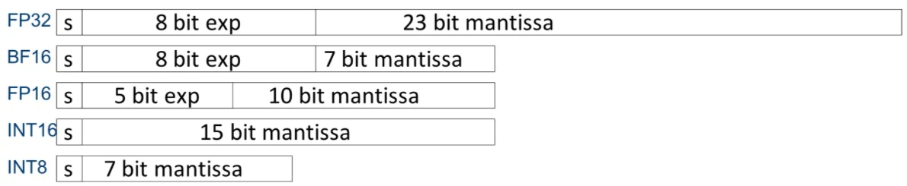
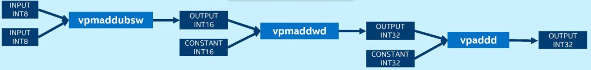
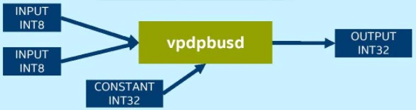

## Introducing Intel&reg; AVX-512 and Intel&reg; Deep Learning Boost

Intel&reg; Advanced Vector Extensions 512 (Intel&reg; AVX-512) is a &ldquo;single instruction, multiple data&rdquo; (SIMD) instruction set based on x86 processors that allows executing multiple data operations with a single instruction. As the name implies, Intel&reg; AVX-512 has a register width of 512 bits, and it supports 16 32-bit single-precision floating-point numbers or 64 8-bit integers.

Intel&reg; Xeon&reg; Scalable Processors support multiple types of workloads, including complex AI workloads.  They improve AI computation performance with the use of Intel&reg; Deep Learning Boost (Intel&reg; DL Boost). Intel Deep Learning Boost includes Intel&reg; AVX-512 VNNI (Vector Neural Network Instructions), AVX512 BF16 and AMX (Advanced Matrix Extension).

AVX-512 VNNI can combine three instructions (vpmaddubsw, vpmaddwd, and vpaddd) into one (vpdpbusd) execution.  This further unleashes the computing potential of next-generation Intel&reg; Xeon&reg; Scalable Processors and increases the inference performance of the INT8 model. 2nd Generation, 3rd Generation, and 4th Generation Intel&reg; Xeon&reg; Scalable Processors all support VNNI.

The AVX-512_BF16 feature includes an instruction (VDPBF16PS) to compute dot product of BF16 pairs and to accumulate to single precision (FP32), as well as instructions (VCVTNE2PS2BF16, VCVTNEPS2BF16) to convert packed single precision data (FP32) to packed BF16 data.

Intel® Advanced Matrix Extensions (Intel® AMX) is a new 64-bit programming paradigm consisting of two components: a set of 2-dimensional registers (tiles) representing sub-arrays from a larger 2-dimensional memory image and an accelerator able to operate on tiles.  The first implementation is called TMUL (tile matrix multiply unit).

### Intel&reg; Deep Learning Boost

| Microarchitecture | AVX-512 VNNI | AVX-512 BF16 | AMX|
|------------------|-------------|-------------|-------------|
| Cascade Lake     | V           |             |             | 
| Cooper Lake      | V           |V            |             | 
| Ice Lake         | V           |             |             | 
| Sapphire Rapids  | V           |V            | V           | 

#### AVX-512 VNNI

Platforms not using VNNI require the&nbsp;<strong>vpmaddubsw, vpmaddwd&nbsp;</strong>and<strong>&nbsp;vpaddd</strong>&nbsp;instructions to complete the multiply-accumulate operations in INT8 convolution operation:

Platforms using VNNI require only one instruction, &ldquo;vpdpbusd&rdquo;, to complete the INT8 convolution operation:

#### AMX

AMX introduces a new matrix register file with eight rank-2 tensor registers called “tiles”.  It also introduces the concept of accelerators that are capable of operating on those tiles. The matrix register file comprises eight tiles (named TMM0…TMM7), each having a maximum size of 16 rows by 64-byte columns for a total size of 1 KiB/register and 8 KiB for the entire register file.  Load a tile representing a small section from a larger image in memory, operate on that tile, and repeat with the next tile that represents the next portion of the image.  When done, store the resultant tile to memory.  The Tile Matrix Multiply (TMUL) unit comprises a grid of fused multiply-add units capable of operating on tiles.

  

##### AMX sub-extensions and related instructions

The AMX extension comprises three sub-extensions: AMX-TILE, AMX-INT8, and AMX-BF16.
| Instruction | AMX-TILE | AMX-INT8 | AMX-BF16|
|-------------|----------|----------|---------|
| LDTILECFG   | V        |          |         | 
| STTILECFG   | V        |          |         | 
| TILELOADD   | V        |          |         | 
| TILELOADDT1 | V        |          |         | 
| TILESTORED  | V        |          |         | 
| TILERELEASE | V        |          |         | 
| TILEZERO    | V        |          |         | 
| TDPBSSD     |          |V         |         | 
| TDPBSUD     |          |V         |         | 
| TDPBUSD     |          |V         |         | 
| TDPBUUD     |          |V         |         | 
| TDPBF16PS   |          |          | V       | 
