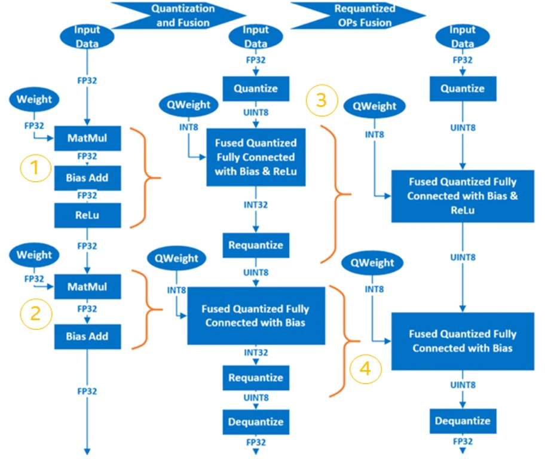

## AI Neural Network Model Low Precision Optimization

### Overview

Intel® 4th Generation Intel® Xeon® Scalable Processors support accelerating AI inference by using low precision data types such as BFloat16 and INT8 based on the Intel® Deep Learning Boost and Intel® Advanced Matrix Extension.

1. Quantization

Using the INT8 data type to optimize AI model is one type of quantization, the process of mapping continuous infinite values to a smaller set of discrete finite values.

2. Mixed Precision

Mixed Precision uses lower-precision data types such as BFloat16 to make models that run with 16-bit and 32-bit mixed floating-point types during training and inference.  This runs faster with less memory consumption.

### Instruction

Intel® 4th Generation Intel® Xeon® Scalable Processors support several instructions to accelerate AI models:

|Intrinsics|AVX512_VNNI|AVX512_BF16|AMX_INT8|AMX_BF16|
|-|-|-|-|-|
|Data type|INT8|BFloat16|INT8|BFloat16|
|Variable type|Vector|Vector|Matrix|Matrix|

AMX_INT8/AMX_BF16 are newer and more advanced intrinsics than AVX512_VNNI/AVX512_BF16.  They offer better performance to support AI applications.  AMX_INT8 has the highest execution priority.  The AI frameworks optimized by Intel will choose AMX_INT8 first.  If it is not available, then AVX512_VNNI will be chosen.

### Steps

1. Convert FP32 model to INT8/BFloat16 model.

   Run quantization or the mixed precision process to get the INT8/BFloat16 model.

2. Execute the INT8/BFloat16 model inference on Intel® 4th Generation Intel® Xeon® Scalable Processors by the AI frameworks optimized for Intel Architecture.

   The AI framework will call highest level instrinsics supported by them in CPU to gain better performance.

   For example: If AI framework calls AVX512_VNNI, instead of AMX_INT8, please check if the newer release supports AMX_INT8 and install right release.

### AI Neural Network Quantization Process

Computations in neural networks are mainly concentrated in the convolution layer and the fully connected layer. The computations on these two layers can be expressed as:  Y = X * Weights + Bias. Therefore, it is natural to focus on matrix multiplication to optimize performance. The way to begin neural network model quantization is by trading-off precision (limited) for performance improvement. By replacing 32-bit floating-point numbers with low-precision integers for matrix operations, it not only speeds up calculations, but also compresses the model, thus saving memory bandwidth.

There are three approaches to the quantization of neural network models:

- Post-Training Quantization (PTQ), which is supported by most AI frameworks. Quantize a trained FP32 model. It execute a calibration process (infer FP32 model with small dataset) and record the data range of every layer's input and output. Then quantize the model according to the data range info. It provides good quantizatin result.

- Quantization-Aware-Training (QAT), which inserts the FakeQuantization node into the FP32 model when the training converges. It increases the quantization-induced noise. During the backpropagation stage of the training, the model weights fall into a finite interval which results in better quantization precision.

- Dynamic Quantization (DQ) is very similar to PTQ. They are both quantization methods used on post-trained models. The difference lies in that the quantization factor in the activation layer is dynamically decided by the data range used when the neural network model is run, while for PTQ samples from a small-scale pre-processed dataset are used to obtain data distribution and range information in the activation layer, then records it permanently in the newly generated quantization model. Of the Intel® Intel® Neural Compressor which we will talk about later on,  onnxruntime supports this method at the backend only.

The basic procedure for the post-training quantization of neural network is as follows:

1. Fuse FP32 OP to INT8 OP. For example, <em>MatMul</em>, <em>BiasAdd</em> and <em>ReLU</em> can be fused into a single quantized OP at the fully connected layer,  <em>QuantizedMatMulWithBiasAndRelu</em>. Different neural network frameworks support different fuse-able OPs.
For Intel® Intel® Neural Compressor, which will be discussed later on, here is a list of fuse-able OPs supported by TensorFlow: [https://github.com/intel/neural-compressor/blob/master/neural_compressor/adaptor/tensorflow.yaml#L110](https://github.com/intel/neural-compressor/blob/master/neural_compressor/adaptor/tensorflow.yaml#L110).
For fuse-able OPs supported by pyTorch, please see : [https://github.com/intel/neural-compressor/blob/master/neural_compressor/adaptor/pytorch_cpu.yaml#L251](https://github.com/intel/neural-compressor/blob/master/neural_compressor/adaptor/pytorch_cpu.yaml#L251)

2. Quantize weights and save them in the quantized model.

3. Quantize the input/activation layer by sampling the calibration dataset to acquire the distribution and range information of the data in the activation layer, which is then recorded in the newly generated quantized model.

4. The Requantize operation is fused into its corresponding INT8 OP to generate the final quantized model.

Using a simple model which includes two layers of  MatMul as an example, we can observe the quantization process as follows:

<div  align="center">
  
</div>

### AI Neural Network Mixed Precision Process

FP32 and BFloat16 have same data range and different decimal part. It's easy to convert FP32 to BFloat16. But use BFloat16 will impact the model accuracy due to the cutted decimal part.

Some operations are numerically-safe for Bfloat16, that means the operation based on Bfloat16 has no obviously accuracy loss compared to FP32;

Some operations are numerically-dangerous for Bfloat16, that means the operation based on Bfloat16 has obviously accuracy loss compared to FP32;

The precedure is as follows:

1. According to the experiment, set the numerically-safe operations to allow set and numerically-dangerous operations to deny set.

   It's allow user to tune it manually by configuration.

2. Convert the operations in allow set to BFloat16.

3. Insert the "Cast" operation between FP32 and BFloat16 operations to convert data from FP32 to BFloat16 or revert.

Above precedure will be handled by AI framework/tool automaticlly.

### Intel® Neural Compressor

[Intel® Neural Compressor](https://intel.github.io/neural-compressor) is one of the key AI software components in the Intel® oneAPI AI Analytics Toolkit.  It is an open-source Python library that runs on Intel CPUs and GPUs.  This toolkit delivers unified interfaces across multiple deep learning frameworks for popular network compression technologies, such as quantization, pruning, and knowledge distillation. It supports automatic, accuracy-driven, tuning strategies to quickly find the best model.  It also implements different weight pruning algorithms to generate a pruned model with a pre-defined sparsity goal and it supports knowledge distillation from a teacher model to a student model.

Reference: [https://github.com/intel/neural-compressor](https://github.com/intel/neural-compressor)

<div  align="center">
  
</div>


Intel® Neural Compressor currently support the following Intel optimized deep learning frameworks:

- [Tensorflow*](https://www.tensorflow.org/)
- [PyTorch*](https://pytorch.org/)
- [Apache* MXNet](https://mxnet.apache.org/)
- [ONNX Runtime](https://onnx.ai/)

The frameworks and their versions that have already been verified are shown below:

* OS version: CentOS 8.4, Ubuntu 20.04
* Python version: 3.7, 3.8, 3.9, 3.10

<table class="docutils">
<thead>
  <tr>
    <th>Framework</th>
    <th>TensorFlow</th>
    <th>Intel TensorFlow</th>
    <th>PyTorch</th>
    <th>IPEX</th>
    <th>ONNX Runtime</th>
    <th>MXNet</th>
  </tr>
</thead>
<tbody>
  <tr align="center">
    <th>Version</th>
    <td class="tg-7zrl"><a href=https://github.com/tensorflow/tensorflow/tree/v2.9.1>2.9.1</a><br>
    <a href=https://github.com/tensorflow/tensorflow/tree/v2.8.2>2.8.2</a><br>
    <a href=https://github.com/tensorflow/tensorflow/tree/v2.7.3>2.7.3</a><br>
    <td class="tg-7zrl"><a href=https://github.com/Intel-tensorflow/tensorflow/tree/v2.9.1>2.9.1</a><br>
    <a href=https://github.com/Intel-tensorflow/tensorflow/tree/v2.8.0>2.8.0</a><br>
    <a href=https://github.com/Intel-tensorflow/tensorflow/tree/v2.7.0>2.7.0</a><br>
    <td class="tg-7zrl"><a href=https://download.pytorch.org/whl/torch_stable.html>1.12.0+cpu</a><br>
    <a href=https://download.pytorch.org/whl/torch_stable.html>1.11.0+cpu</a><br>
    <a href=https://download.pytorch.org/whl/torch_stable.html>1.10.0+cpu</a></td>
    <td class="tg-7zrl"><a href=https://github.com/intel/intel-extension-for-pytorch/tree/v1.12.0>1.12.0</a><br>
    <a href=https://github.com/intel/intel-extension-for-pytorch/tree/v1.10.0>1.11.0</a><br>
    <a href=https://github.com/intel/intel-extension-for-pytorch/tree/v1.9.0>1.10.0</a></td>
    <td class="tg-7zrl"><a href=https://github.com/microsoft/onnxruntime/tree/v1.11.0>1.11.0</a><br>
    <a href=https://github.com/microsoft/onnxruntime/tree/v1.10.0>1.10.0</a><br>
    <a href=https://github.com/microsoft/onnxruntime/tree/v1.9.0>1.9.0</a></td>
    <td class="tg-7zrl"><a href=https://github.com/apache/incubator-mxnet/tree/1.8.0>1.8.0</a><br>
    <a href=https://github.com/apache/incubator-mxnet/tree/1.7.0>1.7.0</a><br>
    <a href=https://github.com/apache/incubator-mxnet/tree/1.6.0>1.6.0</a></td>
  </tr>
</tbody>
</table>

> **Note:**
> Please set the environment variable TF_ENABLE_ONEDNN_OPTS=1 to enable oneDNN optimizations if you are using TensorFlow from v2.6 to v2.8. oneDNN has been fully default from TensorFlow v2.9.

The tuning strategies supported by Intel® Neural Compressor include:

- [Basic](https://github.com/intel/neural-compressor/blob/master/docs/tuning_strategies.md#basic)
- [Bayesian](https://github.com/intel/neural-compressor/blob/master/docs/tuning_strategies.md#bayesian)
- [MSE](https://github.com/intel/neural-compressor/blob/master/docs/tuning_strategies.md#mse)
- [TPE](https://github.com/intel/neural-compressor/blob/master/docs/tuning_strategies.md#tpe)
- [Exhaustive](https://github.com/intel/neural-compressor/blob/master/docs/tuning_strategies.md#exhaustive)
- [Random](https://github.com/intel/neural-compressor/blob/master/docs/tuning_strategies.md#random)

The workflow for Intel® Neural Compressor is shown below. The model quantization parameters matching the accuracy loss target are automatically selected according to the set tuning strategy, and the quantized model is generated:

<div  align="center">
  
</div>


### Installing Intel® Neural Compressor

For details on installation, refer to: [https://github.com/intel/neural-compressor#installation](https://github.com/intel/neural-compressor#installation)

Step 1: Use  Anaconda to create a  Python3.x virtual environment with the name: env_inc. We are using Python 3.9 here as an example:

```
conda create -n env_inc python=3.9
conda activate env_inc
```

Step 2: Install Intel® Neural Compressor with the binary file:

```
# install stable basic version from pip
pip install neural-compressor
# install stable full version from pip (including GUI)
pip install neural-compressor-full
```
or
```
# install nightly basic version from pip
pip install -i https://test.pypi.org/simple/ neural-compressor
# install nightly full version from pip (including GUI)
pip install -i https://test.pypi.org/simple/ neural-compressor-full
```
or
```
# install stable basic version from from conda
conda install neural-compressor -c conda-forge -c intel
# install stable full version from from conda (including GUI)
conda install neural-compressor-full -c conda-forge -c intel
```

Step 3: Install AI Framework

Install Tensorflow, Pytorch, ONNX-RT, MXNet according to the model type to be handled.
For example, to install intel-tensorflow
```
# install intel-tensorflow from pip
pip install intel-tensorflow
```

### Using Intel® Neural Compressor

We are using  ResNet50 v1.0 as an example to explain how to use this tool for quantization and mixed precision optimization.

### Dataset preparation:

Step 1: Download and decompress the ImageNet validation dataset:

To download the raw images, the user must create an account with image-net.org.

```
mkdir –p img_raw/val
cd img_raw
wget http://www.image-net.org/challenges/LSVRC/2012/xxxxxxxx/ILSVRC2012_img_val.tar
tar –xvf ILSVRC2012_img_val.tar -C val
```

Step 2: Move the image files to the child directories sorted by label:


```
cd val
wget -qO- https://raw.githubusercontent.com/soumith/imagenetloader.torch/master/valprep.sh | bash
```

Step 3: Use the script, [prepare_dataset.sh](https://github.com/intel/neural-compressor/blob/master/examples/tensorflow/image_recognition/tensorflow_models/quantization/ptq/prepare_dataset.sh), to convert raw data to the TFrecord format with 128 shards:


```
git clone https://github.com/intel/neural-compressor.git
cd neural-compressor/
git checkout 6663f7b
cd examples/tensorflow/image_recognition/tensorflow_models/quantization/ptq
bash prepare_dataset.sh --output_dir=./data --raw_dir=/PATH/TO/img_raw/val/ --shards=128 --subset=validation
```
Reference: [https://github.com/intel/neural-compressor/tree/master/examples/tensorflow/image_recognition/tensorflow_models/quantization/ptq#2-prepare-dataset](https://github.com/intel/neural-compressor/tree/master/examples/tensorflow/image_recognition/tensorflow_models/quantization/ptq#2-prepare-dataset)

### Pretrained FP32 Model preparation:

```
wget https://storage.googleapis.com/intel-optimized-tensorflow/models/v1_6/resnet50_fp32_pretrained_model.pb
```
### Run Qunatization:

Edit the file: [examples/tensorflow/image_recognition/tensorflow_models/quantization/ptq/resnet50_v1.yaml](https://github.com/intel/neural-compressor/blob/master/examples/tensorflow/image_recognition/tensorflow_models/quantization/ptq/resnet50_v1.yaml), change all default dataset path (root: /path/to/evaluation/dataset) for quantization, evaluation to real local path to save the TFRecord format dataset generated previously during the data preparation stage.


```
cd examples/tensorflow/image_recognition/tensorflow_models/quantization/ptq
bash run_tuning.sh --config=resnet50_v1.yaml \
    --input_model=/PATH/TO/resnet50_fp32_pretrained_model.pb \
    --output_model=./nc_resnet50_v1.pb
```

Reference: [https://github.com/intel/neural-compressor/tree/master/examples/tensorflow/image_recognition/tensorflow_models/quantization/ptq#1-resnet50-v10](https://github.com/intel/neural-compressor/tree/master/examples/tensorflow/image_recognition/tensorflow_models/quantization/ptq#1-resnet50-v10)

### Run Mix Precision (BFloat16 + FP32):

Refer to [Mixed Precision](https://github.com/intel/neural-compressor/blob/master/docs/mixed_precision.md)

#### Convert Without Tuning Accuracy

This method is sample and convert more nodes to BFloat16 as possible. The accuracy of model would be lossed as unexpected.

```
python convert_bf16_without_tuning.py

from neural_compressor.experimental import MixedPrecision
converter = MixedPrecision()
converter.precisions = 'bf16'
converter.model = '/PATH/TO/resnet50_fp32_pretrained_model.pb'
optimized_model = converter()
optimized_model.save('nc_resnet50_v1_bf16.pb')
```
#### Convert With Tuning Accuracy

This method is accuracy driven and needs evaluation precedure. The accuracy of model would be lossed as expected, but less nodes are converted to BFloat16 compared with above method.

1. Edit resnet50_v1.yaml

Add

```
mixed_precision:
  precisions: 'bf16'
```

Like:
```
model:
  name: resnet50_v1
  framework: tensorflow

mixed_precision:
  precisions: 'bf16'

evaluation:
  accuracy:
    dataloader:
      ...
    metric:
      ...
```

2. Run Python
```
python convert_bf16_with_tuning.py

from neural_compressor.experimental import MixedPrecision
converter = MixedPrecision('resnet50_v1.yaml')
converter.precisions = 'bf16'
converter.model = '/PATH/TO/resnet50_fp32_pretrained_model.pb'
optimized_model = converter()
optimized_model.save('nc_resnet50_v1_bf16.pb')
```

### INT8 + BFloat16 + FP32

It's possible to mix INT8, BFloat16, FP32 in a model to optimize performance.

In this example, we could apply mixed precesion on the quantized model: nc_resnet50_v1.pb. So we could get INT8 + BFloat16 + FP32 model.


```
python convert_bf16_without_tuning.py

from neural_compressor.experimental import MixedPrecision
converter = MixedPrecision()
converter.precisions = 'bf16'
converter.model = '/PATH/TO/nc_resnet50_v1.pb'
optimized_model = converter()
optimized_model.save('nc_resnet50_v1_int8_bf16.pb')
```

In the log, we could see there is one operation: MatMul to be converted to BFloat16. That would improve the performance a little more.

If the quantized model has more operations are FP32, mixed precision could convert more to BFloat16 and gain better performance.

```
2022-08-04 19:50:01 [INFO] |**********Mixed Precision Statistics**********|
2022-08-04 19:50:01 [INFO] +-------------+--------+-------+-------+-------+
2022-08-04 19:50:01 [INFO] |   Op Type   | Total  |  INT8 |  BF16 |  FP32 |
2022-08-04 19:50:01 [INFO] +-------------+--------+-------+-------+-------+
2022-08-04 19:50:01 [INFO] |   MaxPool   |   1    |   1   |   0   |   0   |
2022-08-04 19:50:01 [INFO] |   AvgPool   |   1    |   1   |   0   |   0   |
2022-08-04 19:50:01 [INFO] |    Conv2D   |   53   |   53  |   0   |   0   |
2022-08-04 19:50:01 [INFO] |    MatMul   |   1    |   0   |   1   |   0   |
2022-08-04 19:50:01 [INFO] |  QuantizeV2 |   1    |   1   |   0   |   0   |
2022-08-04 19:50:01 [INFO] |  Dequantize |   1    |   1   |   0   |   0   |
2022-08-04 19:50:01 [INFO] |     Cast    |   2    |   0   |   1   |   1   |
2022-08-04 19:50:01 [INFO] +-------------+--------+-------+-------+-------+

```

### Run Benchmark:

For performance:

```
bash run_benchmark.sh --input_model=./xxx.pb --config=resnet50_v1.yaml --mode=performance
```
Performance mode benchmark result:

```
 Batch size = 1
 Latency: xxx
 Throughput: xxx
```

For accuracy:

```
bash run_benchmark.sh --input_model=./xxx.pb --config=resnet50_v1.yaml --mode=accuracy
```

Accuracy mode benchmark result:

```
 Accuracy is x.xx
 Batch size = 32
```


## References

[1] Open source of Faiss project: [https://github.com/facebookresearch/faiss](https://github.com/facebookresearch/faiss)

## Additional References

Intel® AVX-512 info: [https://colfaxresearch.com/skl-avx512/](https://colfaxresearch.com/skl-avx512/)

Intel® Optimized AI Frameworks: [https://www.intel.com/content/www/us/en/developer/tools/frameworks/overview.html](/content/www/us/en/developer/tools/frameworks/overview.html)

Intel® Distribution of OpenVINO&trade; toolkit: [https://docs.openvino.ai](https://docs.openvino.ai)

Intel® Analytics Zoo: [https://github.com/intel-analytics/analytics-zoo](https://github.com/intel-analytics/analytics-zoo)

Open source of HNSWLib project: [https://github.com/nmslib/hnswlib](https://github.com/nmslib/hnswlib)

