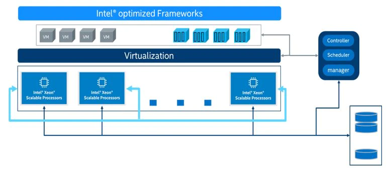

## Overview

This guide is for users who are familiar with using [Intel® AI Analytics Toolkit](https://www.intel.com/content/www/us/en/developer/tools/oneapi/ai-analytics-toolkit.html) and [Intel® Distribution of OpenVINO™ Toolkit](https://www.intel.com/content/www/us/en/developer/tools/openvino-toolkit/overview.html) for AI training and inference on Intel® Xeon® Scalable Processors. In this guide, we will focus on introducing new features on the 4th Generation Intel® Xeon® Scalable Processor platform and how to enable these features with Intel® optimized AI Toolkits. It provides recommendations for configuring hardware and software that will provide the best performance in most situations. However, please note that we rely on users to carefully consider these settings for their specific scenarios, since these tools can be deployed in multiple ways.

The 4th Generation Intel&reg; Xeon&reg; Scalable Processor platform is an unique, scalable platform optimized for different workloads acceleration including HPC, AI, BigData, Networking etc. with higher performance and TCO efficiency: 

- More cores with up to 56 cores per socket and up to 448 cores in an 8-socket platform
- New built-in AI acceleration engine, Intel® Advanced Matrix Extensions (AMX), which accelerates a variety of AI Inference and Training workloads (NLP, recommendation systems, image recognition…) with BF16 and INT8 datatype support
- Increased memory bandwidth and speed with DDR5 (vs. DDR4) and High Bandwidth Memory (HBM) for memory-bound workloads 
- Accelerate time to data analysis with new integrated In-Memory Database Accelerator (IAX)
- High throughput for latency-sensitive workloads with up to 2x I/O bandwidth with PCIe 5.0
- Increased overall system performance with Intel Dynamic Load Balancer (DLB) – efficient handling of network data
- Up to 4x cryptography and data compression workloads acceleration with Integrated Intel QuickAssist Technology (QAT) 

### AI Stages

A typical deep learning application has following stages:

Each stage requires the allocation of these resources:  

- Computational power
- Memory
- Storage for datasets
- Communication link between compute nodes
- Optimized softwares

Choosing the right combination of resources greatly accelerates the efficiency of your AI services.  All of the processes including dataset preparation, model training, model optimization, and model deployment, can be done on a 4th Generation Intel&reg; Xeon&reg; Scalable Processor platform-based infrastructure that supports machine learning/deep learning platforms for training and inference. A proposed infrastructure is shown in the figure below:

### AI Optimization Topics

The complete guide is available to download in PDF format.  This version offers more flexibility.  To get started, read these sections in the order listed below.  As you continue to optimize performance, use these as quick reference guides.

[Introducing Intel® AVX-512 and Intel® Deep Learning Boost](spr_amx.md) - coming soon

[Linux Operating System Optimization](spr_environment.md)  - coming soon

[Using TensorFlow*](spr_tf.md)  - coming soon

[Using Intel® Extension for PyTorch*](spr_pytorch.md)  - coming soon

[Uisng Intel® Neural Compressor for Model Quantization](spr_inc.md) - coming soon

[Using Intel Distribution of OpenVINO Toolkit for Inference Acceleration](spr_ov.md) - coming soon

[Data Analytics and Machine Learning Acceleration](spr_ml.md) - coming soon

