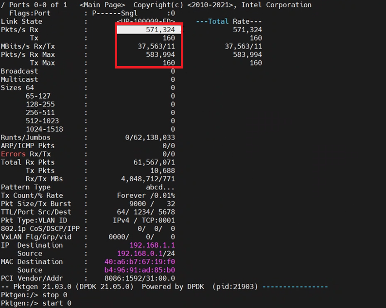

# User space network stack Acceleration with DSA on 4th Gen Intel® Xeon® Scalable processor

## Introduction

This guide is for users who are already familiar with user space network stack.  It provides recommendations for configuring hardware and software that will provide the best performance in most situations. However, please note that we rely on the users to carefully consider these settings for their specific scenarios, since can be deployed in multiple ways. 

IDC data plane always have large number and frequently data need process, the typical scenario is user space network stack based on Intel DPDK. Due to gain best performance, zero-copy concept is a well-known concept, but it’s also with below disadvantages: Application coupled with user space network stack because the user data buffer and network stack data buffer should both come from DPDK mbuf pool, this means we should modify many already using/deploying workloads such as httpd, this surely increase software product release and cost, so many user space stacks implementation will copy the data from application to stack in network API. 

4th Gen Intel® Xeon® Scalable processors deliver workload-optimized performance with built-in acceleration for AI, encryption, HPC, storage, database systems, and networking. Intel® Data Streaming Accelerator is suitable for memory copy scenarios of user space network stack. Bases on this,  we developed Intel® Vector Data Streaming Library, we implemented a user space library to let users can utilize DSA to do memory movement, and take mTCP as the user space stack implementation example to show the benefit. We implement different modes to satisfy different user scenario requirements: single mode, async mode, vector mode. And we also do further optimization to mTCP in TCP unpacking. These works will be discussed more fully later in this article. 

Optimization on user space network stack that can run on Sapphire Rapids including:

- Intel® Vector Data Streaming Library including Intel® Data Streaming Accelerator (Intel® DSA)

### Server Configuration

#### Hardware

The configuration described in this article is based on 4th Generation Intel® Xeon® processor hardware. The server platform, memory, hard drives, and network interface cards can be determined according to your usage requirements.

| Hardware | Model |
|----------------------------------|------------------------------------|
| Board | EAGLESTREAM, E63448-400 |
| CPU | Intel® SPR E3 stepping, base Frequency 1.9GHz |
| BIOS | EGSDCRB1.86B.0080.D21.2205151325 |
| Memory | 224 GB(14x16GB DDR5 4800 MT/s) |
| Storage/Disks | INTEL SSDSC2KB960G8 |
| NIC (if it applies) | Intel® E810 100GbE Ethernet Network Adapter |

#### Software

| Software | Version |
|------------------|-------------|
| Operating System | CentOS Stream release 8 |
| Kernel | v6.0 or later version |
| Workload | mTCP accel with DSA example in Intel® Vector Data Streaming Library |
| GCC | version: 10.2.0 |
| accel-config | version: 3.4.4+ |
| DSA configuration | 1 instance, 4x engine, 1x work-queue dedicated mode |

## Hardware Tuning

This guide targets the usage of user space network stack on 4th Gen Intel Xeon Scalable processors with Intel® Data Streaming Accelerator (Intel® DSA). 

DSA 1.0 Technical Specification has already publicly disclosure and publication on February 2022. The spec passed all technical and BU approvals and is being processed for further publication on [Intel SDM website](https://www.intel.com/content/www/us/en/developer/articles/technical/intel-sdm.html).

[Intel® Data Streaming Accelerator Architecture Specification](https://cdrdv2.intel.com/v1/dl/getContent/671116).

### BIOS Settings

Download BIOS binaries from Intel or ODM released BKC matched firmware binaries(for example BKC#57, which we chose), and flush them to the board. 

Some BIOS configuration items:

| Configuration Item | Recommended Value|
|---------------------|------------------|
| EDKII Menu-> Socket Configuration -> IIO Configuration -> Intel VT for directed IO (VT -d) ->Intel VT for directed IO | Enable |
| EDKII Menu-> Socket Configuration -> IIO Configuration -> PCI ENQCMD/ENQCMDS | Enable |
| EDKII Menu -> Socket Configuration -> Uncore Configuration -> Uncore Dfx Configuration: Cache entries for non-atomics | 120 |
| EDKII Menu -> Socket Configuration -> Uncore Configuration -> Uncore Dfx Configuration: Cache entries for atomics | 8 |
| EDKII Menu -> Socket Configuration -> Uncore Configuration -> Uncore Dfx Configuration: CTAG entry avail mask | 255 |
|  |  |

### DSA Setting

 Enable 1 DSA device, 4 engine and 1dedicated work queue, will be configured by script tool in following software tuning step.

### Memory Configuration/Settings

No specific workload setting

### Storage/Disk Configuration/Settings

No specific workload setting

### Network Configuration/Setting

Got two server machines one with Intel SPR CPU, another with ICE CPU(or other server CPU is OK). Insert each machine with Intel 100GbE E810 NIC, and then connect the two machines with fibre directly.


## Software Tuning 

Software configuration tuning is essential. From the operating system to (the workload) configuration settings, they are all designed for general purpose applications and default settings are almost never tuned for best performance.

### Linux Kernel Optimization Settings

Typically, we choose CentOS 8 Stream OS for the PoC environment, due to enable DSA, so we need update its kernel.We can use v6.0 or later version from Linux kernel community. Before compiling the kernel, check DSA related configurations are supported:

```
CONFIG_INTEL_IDXD=m

CONFIG_INTEL_IDXD_BUS=y

CONFIG_INTEL_IDXD_COMPAT=y

CONFIG_INTEL_IDXD_PERFMON=y

CONFIG_INTEL_IDXD_SVM=y

CONFIG_VFIO_MDEV_IDXD=m

CONFIG_IRQ_REMAP=y

CONFIG_INTEL_IOMMU=y

CONFIG_INTEL_IOMMU_SVM=y

CONFIG_IMS_MSI=y

CONFIG_IMS_MSI_ARRAY=y

CONFIG_IRQ_REMAP=y

CONFIG_PCI_ATS=y

CONFIG_PCI_PRI=y

CONFIG_PCI_PASID=y

CONFIG_DMA_ENGINE=m

CONFIG_DMATEST=m
```

Build with make command, and with make install command to install the new kernel version, use grubby command to set the boot option for newly installed kernel version. 

Use uname command to check kernel version after rebooting.

### User space network stack with DSA acceleration Architecture

DSA accelerate app to network stack memory copy:


DSA accelerate network stack unpacking:


### User space network stack Tuning

#### Download Source Code

```
git clone https://github.com/intel/Intel-Vector-Data-Streaming-Library.git

```

#### DSA Configuration

**accel-config** is a user-space tool for controlling and configuring DSA hardware devices.

**How to install accel-config tool**, please refer to *https://github.com/intel/idxd-config*, 

do not use the latest version, before compile & install,  you can run:

```
git checkout 6bd68e68
```

Below is the command to enable 1 DSA device, 4 engine and 1dedicated work queue:

```shell
cd Intel-Vector-Data-Streaming-Library/dsa_userlib/config_dsa

#Configure with script tool
./setup_dsa.sh -d dsa0 -w 1 -m d -e 4
```

### Memory Configuration/Settings

#### Build PoC 

```
#Enter mtcp directory
cd Intel-Vector-Data-Streaming-Library
cd example_mtcp

#Run script pre_dpdk2203.sh to git clone dpdk v22.03, and then build and install it 
./pre_dpdk2203.sh ~/dpdk2203

#Run script pre_compile.sh to prepare the environment before you building this project: 
./pre_compile.sh

#Set env
export PKG_CONFIG_PATH=${PKG_CONFIG_PATH}:~/dpdk2203/lib64/pkgconfig
export LD_LIBRARY_PATH=${LD_LIBRARY_PATH}:~/dpdk2203/lib64

#Run make command to build the project.
make
```


#### DPDK environment configuration

Build and install igb_uio.ko

```
git clone http://dpdk.org/git/dpdk-kmods

cd dpdk-kmods/linux/igb_uio/

make

modprobe uio

insmod igb_uio.ko
```

Setup hugepage mappings

```
mkdir -p /mnt/huge
mount -t hugetlbfs nodev /mnt/huge

#Set 4x1G hugepages each numa node
echo 4 > /sys/devices/system/node/node0/hugepages/hugepages-1048576kB/nr_hugepages
echo 4 > /sys/devices/system/node/node1/hugepages/hugepages-1048576kB/nr_hugepages
```

Bind nic to uio

```
#Down nic interface in kernel driver
ifconfig ensXX down

#Bind nic to uio
${RTE_SDK}/usertools/dpdk-devbind.py -b igb_uio $PCI_PATH
```

#### Packet receiver server setup steps

For details, please refer to https://pktgen-dpdk.readthedocs.io/en/latest/getting_started.html

1. Build and install DPDK to your packet receiver machine

2. Clone pktgen-dpdk repo and build it

```
git clone http://dpdk.org/git/apps/pktgen-dpdk
```

Use make command to build it.

3. Set DPDK, allocate huge pages, bind NIC to DPDK.

4. Launch pktgen-dpdk tool, like

```
./usr/local/bin/pktgen -c 0x3 -n 2 -- -P -m "1.0"
```

5. Enter the following command in pktgen cmdline to send packets:

```
#this mac address is SPR NIC mac address
set 0 dst mac 40:a6:b7:67:19:f0

set 0 proto tcp

set 0 size 5000

set 0 rate 0.01

start 0

#if you want pause, you can enter:
stop 0
```


#### Performance Measurement 

You can observe PPS and bandwidth in PKTGEN




#### mTCP APP Configuration File

```
cd example_mtcp/apps/example
vim epping.conf

#modify port to your NIC PCIE number, for example:
port = 0000:29:00.0 (your NIC PCIE number)
```

### Implementation and performance of CPU & DSA async mode

#### Benchmark with CPU

```
cd example_mtcp/apps/example

# 4K
./epping -f epping.conf -l 4k -n 32768

# 8K
./epping -f epping.conf -l 8k -n 16384

# 32K
./epping -f epping.conf -l 32k -n 4096

# 256K
./epping -f epping.conf -l 256k -n 512

# 1M
./epping -f epping.conf -l 1m -n 128

# 2M
./epping -f epping.conf -l 2m -n 64
```

#### Benchmark with DSA async mode

```
cd example_mtcp/apps/example

# 4K
./epping -f epping.conf -l 4k -n 32768 -d

# 8K
./epping -f epping.conf -l 8k -n 16384 -d

# 32K
./epping -f epping.conf -l 32k -n 4096 -d

# 256K
./epping -f epping.conf -l 256k -n 512 -d

# 1M
./epping -f epping.conf -l 1m -n 128 -d

# 2M
./epping -f epping.conf -l 2m -n 64 -d
```

### Performance comparison


#### Implementation and performance of CPU & DSA unpacking

#### Benchmark with CPU unpacking

```
# unpacking to 64 Bytes packet
./epping -f epping.conf -d -m 64

# unpacking to 128 Bytes packet
./epping -f epping.conf -d -m 128

# unpacking to 256 Bytes packet
./epping -f epping.conf -d -m 256

# unpacking to 512 Bytes packet
./epping -f epping.conf -d -m 512

# unpacking to 1024 Bytes packet
./epping -f epping.conf -d -m 1024

# unpacking to 1460 Bytes packet
./epping -f epping.conf -d -m 1460

# unpacking to 4096 Bytes packet
./epping -f epping.conf -d -m 4096

# unpacking to 8192 Bytes packet
./epping -f epping.conf -d -m 8192
```

#### Benchmark with DSA unpacking

```
# unpacking to 64 Bytes packet
./epping -f epping.conf -du -m 64

# unpacking to 128 Bytes packet
./epping -f epping.conf -du -m 128

# unpacking to 256 Bytes packet
./epping -f epping.conf -du -m 256

# unpacking to 512 Bytes packet
./epping -f epping.conf -du -m 512

# unpacking to 1024 Bytes packet
./epping -f epping.conf -du -m 1024

# unpacking to 1460 Bytes packet
./epping -f epping.conf -du -m 1460

# unpacking to 4096 Bytes packet
./epping -f epping.conf -du -m 4096

# unpacking to 8192 Bytes packet
./epping -f epping.conf -du -m 8192
```


#### Performance comparison


## Related Tools and Information

mTCP is a high-performance user-level TCP stack for multicore systems. Scaling the performance of short TCP connections is fundamentally challenging due to inefficiencies in the kernel. mTCP addresses these inefficiencies from the ground up - from packet I/O and TCP connection management all the way to the application interface. For more details, please refer to https://shader.kaist.edu/mtcp/

Pktgen is a traffic generator powered by DPDK at wire rate traffic with 64 byte frames. For codes and details, please refer to https://pktgen-dpdk.readthedocs.io/

## Conclusion

As the amount of data sent at one write increases, the end-to-end performance of the mTCP using DSA copy is significantly improved compared with using CPU copy,E2E throughput boosts up to 60% when send size is 1M bytes, and CPU utilization of memcpy reduced from 40% to 1% .

DSA used in the unpacking acceleration scenario also got significantly performance improved as the packets become larger. When unpacking to 4096 bytes payload packets, the performance improved by nearly 80%, when unpacking to 8192 bytes payload packets, the output bandwidth reaches the line rate of  E810 NIC (100Gbps, protocol stack thread uses one CPU core).

## Feedback

We value your feedback. If you have comments (positive or negative) on this guide or are seeking something that is not part of this guide, please reach out and let us know what you think. 
 
